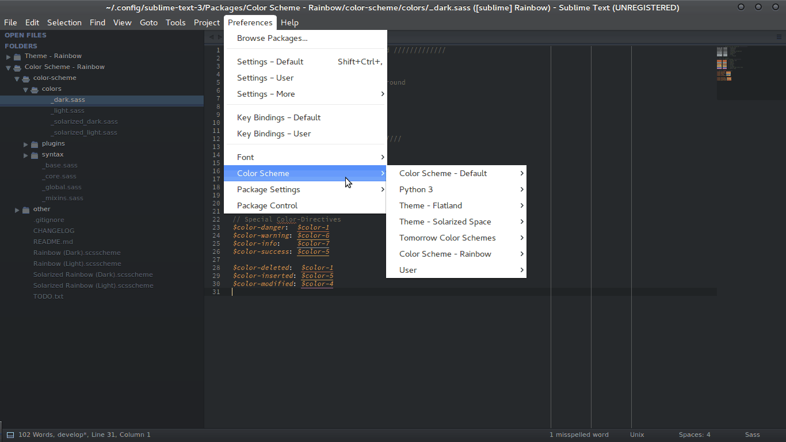

# Theme - Rainbow

Light and Dark Sublime Text UI themes that adapts to your active colour scheme. Based on [Soda Theme] by Ian Hill.

> PR with better screencast more than welcome!



## WOW! How do I get this?

### Via Package Control (not active yet)
Install the themes using Sublime Package Control, it's listed as `Theme - Rainbow`. You're ready for activating the package!

### Manually
Clone the package in Sublime's Packages directory:

```
git clone https://github.com/pradyunsg/Sublime-Rainbow-Theme
```

After cloning, open Sublime Text and in the Command Palette run `Package Control: Satisfy Dependencies`. This second step is necessary since this package has a dependency on jinja2,  which is provided as a dependency by Package Control. Restart Sublime Text and you're ready for activating the package!

## Activate the theme
This theme is activated as simply as any other theme. Open your Preferences file (via menu: Preferences -> Settings - User) and add/modify the `theme` key to one of the following variants of the theme:

 - `Rainbow Soda Light.sublime-theme`
 - `Rainbow Soda Dark.sublime-theme`

Example:

```json
{
    "theme": "Rainbow Soda Light.sublime-theme"
}
```

> I plan on adding flat variants of the same after fixing some quirks in the current theme generation code.

## How does it work?
The themes are re-generated on the fly when you change the colour scheme. These changes are picked up by Sublime Text and become visible.

This package uses the same algorithms to determine the base-colours for the UI elements as `one-light-ui` and `one-dark-ui` from Atom, ported to pure-Python. These base-colours are used when generating the themes.

### Issues faced while trying make this?

- ST does not acknowledge changes to Widget Schemes on the fly.
    - If support for modification and re-loading of Widget Schemes on the fly is added, it'll be awesome! That'll make this package a tiny bit simpler but more importantly, it'll make ST's behaviour more consistent.


### License
Theme - Rainbow is licensed under the [Creative Commons Attribution-ShareAlike 3.0 License].
  [Creative Commons Attribution-ShareAlike 3.0 License]: https://creativecommons.org/licenses/by-sa/3.0/
  [Soda Theme]: http://buymeasoda.com/
